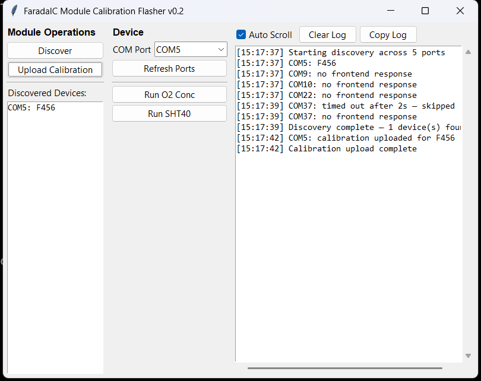
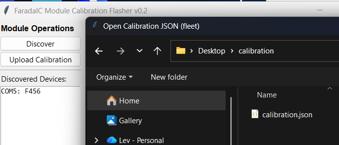

# FaradaIC Module Calibration Flasher



Allows to flash the calibration to the Faraday-Ox Module

1. Connect Module to the PC via UART USB converter.
2. Press "Discover" button to discover all the modules connected to the PC (one or more)
3. Press "Upload Calibration button". In the opened windows select the *calibration.json" file.



4. After successful calibration upload the log window contains this text:
```
[15:17:39] Discovery complete — 1 device(s) found
[15:17:42] COM5: calibration uploaded for F456
[15:17:42] Calibration upload complete
```

5. In case of an Error, the cause will be the log window will contain Error description.
