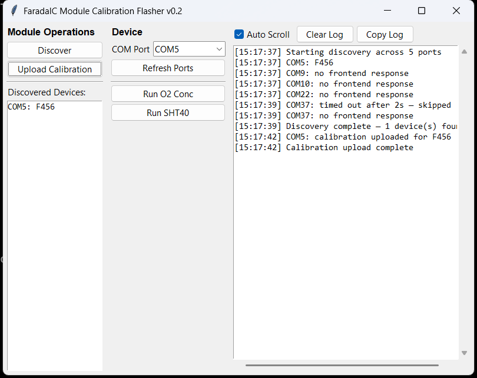
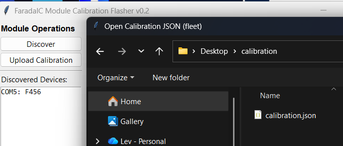

# FaradaIC Module Calibration Flasher



Allows to flash the calibration to the Faraday-Ox Module

1. Connect Module to the PC via UART USB converter.
2. Press "Discover" button to discover all the modules connected to the PC (one or more)
3. Press "Upload Calibration button". In the opened windows select the *calibration.json" file.



4. After successful calibration upload the log window contains this text:
```
[15:17:39] Discovery complete — 1 device(s) found
[15:17:42] COM5: calibration uploaded for F456
[15:17:42] Calibration upload complete
```

5. In case of an Error, the cause will be the log window will contain Error description.

## Migrating a module from firmware v1.11 to v1.17

Firmware v1.17 changed the flash settings structure version, so on its first
boot it overwrites every stored setting with defaults. Back the settings up
before flashing and write them back afterwards.

Both buttons work on the module selected in the **Serial Port** box, one module
at a time.

1. With the module still running v1.11, select its port and the protocol it
   speaks (FaradaIC or Blulog), then press **Get Module Settings v11**. Save the
   JSON, one file per module — the suggested name is `F<id>_v1.11_settings.json`.
   The file holds the calibration, the module/sensor IDs, the RH potentials
   table, the idle mode config and the measurement script.
2. Flash v1.17 onto the module.
3. Select the **FaradaIC** protocol — a freshly flashed v1.17 module always
   starts on it — then press **Write Module Settings v17** and pick the JSON.
   The app writes the settings, stores them to flash, uploads the script, stores
   it to flash, and reads everything back to verify.
4. The restore always turns two bits on, whatever the backup says:
   **standby idle mode** (`REG_CONFIG` bit 0) and the **Blulog wire protocol**
   (`REG_CONFIG_FIRMWARE` bit 0). Both take effect on the next reset, so
   power-cycle the module afterwards. From then on it wakes over its GPIO
   interrupt instead of UART, and only answers the **Blulog** protocol — select
   that radio button for any further work with the module.

The JSON is plain text and can be inspected or edited before the restore. The
`raw` section keeps the untouched register page and script bytes for reference;
the restore uses the `settings` and `script` fields.

### Script commands dropped in v1.17

v1.17 removed the `5V` command and the `CE_BUF` pin from the script parser, so a
script still carrying them is rejected on upload. The backup strips those lines
automatically and lists them under `script_removed_lines` and in the log:

```
[15:17:39] COM5: dropped script line not supported by v1.17: 0 PIN CE_BUF 1
[15:17:39] COM5: dropped script line not supported by v1.17: 5 5V 1
```

Everything else — comments, blank lines, ordering, timestamps, line endings — is
left byte-for-byte unchanged, and the module's original script is still readable
from `raw.script_hex`. The filter runs again on restore, so older backup files
and hand-edited ones upload cleanly too.
